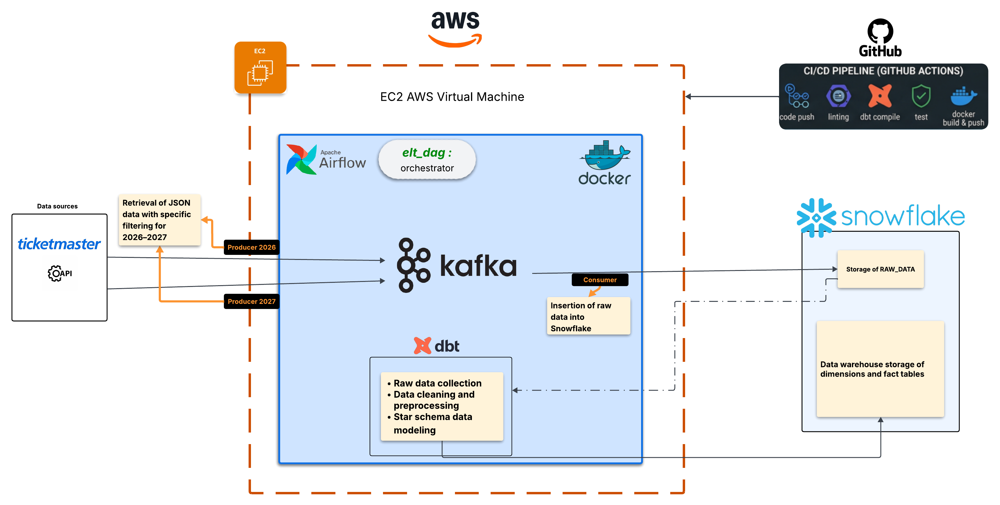
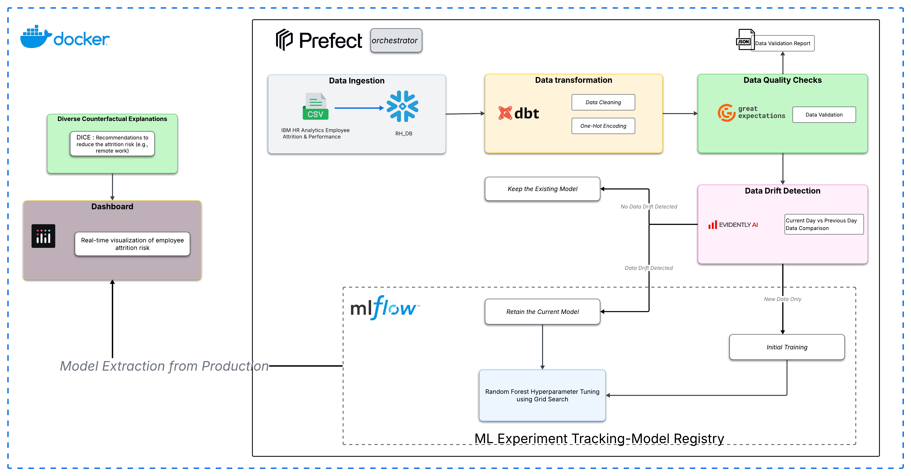
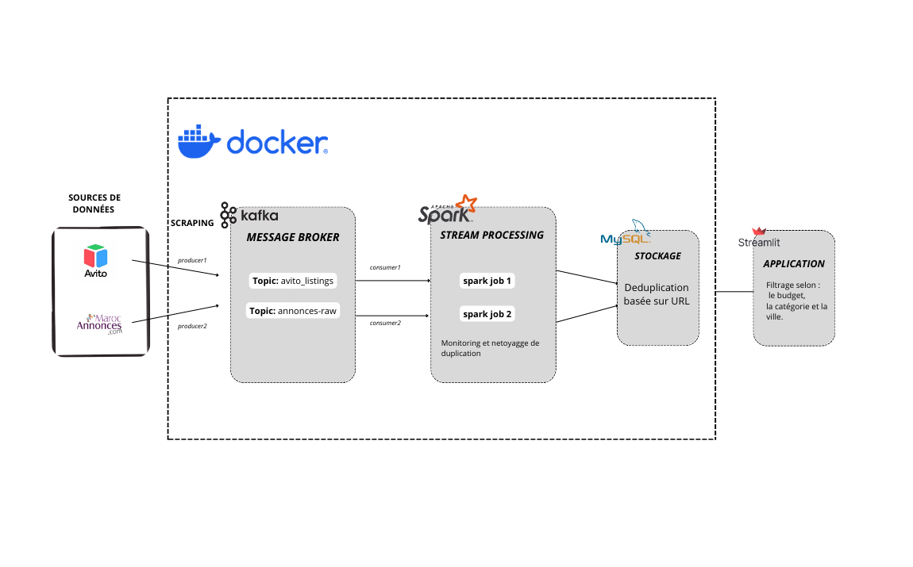

# 📊 Portfolio - Data Engineering & AI

Bienvenue dans mon portfolio ! Découvrez mes projets, compétences et réalisations dans les domaines du **Data Engineering**, **Cloud Computing** et de l'**Intelligence Artificielle**.

## 📫 Me contacter

---

## 👋 Me Présenter

### Qui suis-je ?

Je suis **Khadija El Merahy**, étudiant en 4e année d'Ingénierie à **l'ENSA Berrechid**, spécialisé en **Systèmes d'Information et Big Data**.

Passionné par le **Data Engineering**, le **Cloud Computing** et l'**IA**, j'aime concevoir et déployer des **pipelines de données scalables** et des **systèmes de production robustes**.

### Expérience Professionnelle

**Data & AI Intern** | Residences Dar Saada | Juillet 2025
-  Conception d’un système multi-agents(5 agents IA)dédiéàl’automatisation de l’ingestion et du requêtage de données complexes
- Développement et orchestration d’agents intelligents spécialisés, permettant de traduire des requêtes textuelles utilisateurs en
requêtes techniques de bases de données (réduction du temps de traitement de 70%).
- **Technologies** : Python, MySQL, LLMs (GPT 4.o), Agno Framework, Power BI

---

## 💼 Services

| Service | Description |
|---|---|
| 🧹 **Préparation des données** | Nettoyage, validation, transformation et enrichissement de données brutes |
| 🔄 **Pipelines ETL / ELT** | Conception et déploiement de pipelines scalables de bout en bout |
| ⚙️ **Automatisation des workflows** | Orchestration et scheduling de tâches avec Airflow, Prefect |
| 🤖 **Intégration de solutions IA** | Intégration de LLMs, agents IA et modèles ML dans des systèmes existants |
| 📊 **Business Intelligence & Modélisation** | Modélisation dimensionnelle, dashboards Power BI, Star Schema |

---

## 🛠️ Technical Skills

### 📈 Data Engineering

---

### ☁️ Cloud & Infrastructure

---

### 🗄️ Bases de Données

---

### 💻 Programming

---

### 🤖 AI & Machine Learning

---

### 📊 Business Intelligence

---

# 🚀 Mes Projets

## 1️⃣ 🎟️ End-to-End ELT Pipeline – Ticketmaster

**Contexte & Problème** : Collecter et centraliser des données d'événements mondiaux (2026–2027) depuis l'API Ticketmaster pour en extraire de la valeur analytique.

**Architecture** : Python → Apache Kafka → Snowflake (RAW) → dbt (Star Schema), orchestré par Airflow et déployé sur AWS EC2 via Docker.

**Résultats** : Pipeline ELT scalable et automatisé, données prêtes pour l'analyse en entrepôt.

---

## 2️⃣ 🧠 Production-Ready MLOps Pipeline – HR Attrition Analytics

**Contexte & Problème** : Le turnover des employés impacte la productivité et les coûts. L'objectif est de passer d'une RH réactive à une stratégie proactive basée sur les données.

**Architecture** : CSV → Snowflake → dbt (GOLD) → Great Expectations → Evidently AI (drift) → Scikit-learn + MLflow → Dashboard Dash.

**Résultats** : Prédiction des employés à risque, retraining automatique, dashboard de simulation RH interactif.

---

## 3️⃣ 🛒 E-Commerce Data ETL Pipeline

**Contexte & Problème** : Transformer 100k+ commandes brutes en datasets analytiques fiables et exploitables.

**Architecture** : Python + Apache Spark (traitement distribué) → AWS S3 (Data Lake) → Snowflake, architecture Medallion Bronze / Silver / Gold, orchestrée par Airflow.

**Résultats** : Données nettoyées et modélisées, prêtes pour la BI et le reporting.

---

## 4️⃣ 🎯 Real-Time Streaming Pipeline – Annonces Marocaines

**Contexte & Problème** : Agréger en temps réel des annonces de plateformes marocaines (Avito, MarocAnnonces) et permettre un filtrage interactif par budget, catégorie et ville.

**Architecture** : Scraping Python → Apache Kafka → Apache Spark Streaming → MySQL → Interface Streamlit.

**Résultats** : Flux d'annonces en temps réel, interface utilisateur interactive, déployé sous Docker sur WSL Ubuntu.

---

# 🎓 Formation & Certifications

## 🎓 Éducation

### ENSA Berrechid – Cycle Ingénieur

**Systèmes d'Information & Big Data** | 2022 – 2027

---

## 📜 Certifications

* Data Science & Machine Learning MasterClass – Udemy
* Introduction to Apache Airflow – DataCamp
* Introduction to dbt – DataCamp

---

# 🌍 Langues

*  English : B2
*  Français : B2
*  Arabe : Natif
